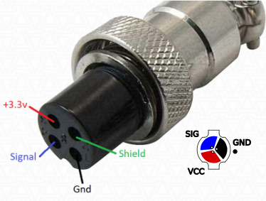

# Grip Adapters

The VPforce mainboard uses a Thrustmaster-compatible 5-pin grip interface. The adapter you need depends on which grip manufacturer you use.

---

## Native Support (No Adapter Required)

- **Thrustmaster grips** (Cougar, Warthog, F/A-18C) — connect directly to the 5-pin interface. Up to 24 buttons.
- **Virpil grips** (MongoosT-50, WarBRD, Constellation Alpha, Alpha Prime, VFX, AH-64, UH-60, FLNKR) — connect directly. Analog axis data and LED control are supported natively.
- **FC Technologies grips** — connect directly to the 5-pin interface.

---

## WinWing Adapter

{ width="200px" }

The WinWing adapter converts WinWing's proprietary protocol to the Thrustmaster 5-pin standard mechanically and electrically. Unlike native Thrustmaster or Virpil connections, this adapter passes **analog axis data** (brake levers and thumbsticks) to the mainboard.

**Tested and working with:** WinWing F-16EX and F/A-18.

**Setup:**

1.  Mount the WinWing grip onto the adapter.
2.  In the VPforce Configurator, select **"WinWing adapter"** as the grip type from the dropdown menu.

!!! note "Button 32 indicator"

    On newer WinWing adapter firmware revisions, button 32 activates if the grip connection is not detected or is disconnected. This is normal behavior, not an error.

!!! note "Analog axis calibration"

    If a WinWing grip does not report analog axis data, calibrate it in WinWing software on a WinWing base first, then reconnect the grip to the Rhino.

---

## VKB Adapter

{ width="200px" }

This page covers separate VKB adapter variants for socket rev. B and rev. C grips. Choose the adapter revision that matches your grip socket.

**Requirements:**

- The VKB adapter (mechanical mount).
- A VKB main controller ("Black Box") — required to operate the grip buttons.

**How it works:**

There is no electrical connection between the adapter and the VPforce mainboard. The Black Box connects to the grip via the external adapter cable and handles all button inputs independently. The Black Box may blink red because it does not detect axis inputs. This is normal and does not affect operation.

**Installing the adapter:**

1.  Push the connector into the grip until it makes contact.
2.  Secure the grip with the locking collar.

If the connector is tight, do not apply force to the rotating lower part only. Rotate the entire lower half instead.

**Using VKB buttons in VPforce software:**

To use VKB grip buttons in the Rhino software, run the **RhinoLoopback** companion app and set **Grip Type** to **Loopback** so the Black Box buttons are forwarded to the Rhino. See the [Configurator Settings](../rhino/using-the-rhino.md#grip-type-selection-and-calibration) section in the Rhino manual for setup details.

---

## Custom Grips (Shift-Register)

The VPforce mainboard supports custom-built grips using generic shift-register button inputs via the 5-pin interface. To use a custom grip, select **"Generic (shift-register)"** as the grip type in the VPforce Configurator.

This allows DIY builders to wire their own button matrices using shift registers (e.g., 74HC165) connected to the mainboard's SPI interface.

---

## Troubleshooting

### Connectivity

**Symptom:** WinWing grip buttons or axes do not respond.  
**Cause:** Incorrect grip type selected in the VPforce Configurator or loose adapter connection.  
**Resolution:** Verify that **"WinWing adapter"** is selected in the **Settings** tab and ensure the locking collar is fully tightened.

**Symptom:** VKB grip buttons do not trigger Rhino functions.  
**Cause:** RhinoLoopback is not running, so the VKB Black Box buttons are not being forwarded to the Rhino.  
**Resolution:** Start the **RhinoLoopback** app and set the Grip Type to **"Loopback"** in the VPforce Configurator.

**Symptom:** Button 32 is permanently active on a WinWing grip.  
**Cause:** The grip is disconnected or the adapter firmware is a newer revision.  
**Resolution:** Check the physical connection. If the grip works otherwise, ignore the indicator as it is a normal presence detection behavior on newer firmware.

### Axis Issues

**Symptom:** WinWing brake lever or thumbstick reports no movement.  
**Cause:** The grip requires periodic re-calibration or is not initialized.  
**Resolution:** Connect the grip to an original WinWing base and perform an axis calibration using WinWing software, then return it to the Rhino.

**Symptom:** VKB "Black Box" light blinks red.  
**Cause:** The controller does not see any axis inputs (expected behavior as Rhino handles axes).  
**Resolution:** This is normal operation. No action is required. If the cable from the Black Box to the grip is loose or disconnected, reconnect it.

### Black Box Not Reading the Grip

A single blinking LED because the Black Box sees no axis input is normal (see [Axis Issues](#axis-issues)). The entries below cover the grip being **not detected at all** or its **buttons not reaching the Rhino**. Most of these trace to the Black Box, not the Rhino.

!!! tip "First check: does the Black Box see the grip?"

    Open the VKB software (DevConfig) and press the buttons and hats. If they light up, the Black Box and grip are fine - the problem is the bridge to the Rhino (see [RhinoLoopback](#connectivity)). If they do not, the Black Box is not reading the grip - continue below.

**Symptom:** The Black Box blinks all three red LEDs, or the VKB software shows the Black Box but not the grip.  
**Cause:** Wrong firmware for the grip, or the Black Box is not in standalone mode, or initialization was not finished after flashing. Each grip needs the firmware that matches its exact model and the Black Box color (orange or black).  
**Resolution:** Flash the firmware for your specific grip in the VKB software, then press **Default** to initialize. In the VKB configurator, disable the base so the Black Box runs **standalone**. If you swap grips, press **Default** after each swap.

**Symptom:** A Gunfighter **Mk4** grip is not recognized on the Rhino but works on the original VKB base.  
**Cause:** Black Box firmware released **after v2.20** is incompatible with a Gunfighter Mk4 grip on a non-VKB base.  
**Resolution:** Downgrade the Black Box firmware to a version **before v2.20**; the grip then initializes on the Rhino adapter.

**Symptom:** The Black Box still does not detect the grip after the correct firmware.  
**Cause:** A broken or poor connection at the grip-to-Black-Box connector, or a loose internal cable.  
**Resolution:** Verify **continuity** of the three contacts at that connector - **VCC (3.3 V)**, **Signal (SIG)**, and **GND** - from the Black Box side to the grip side, using a multimeter in continuity mode. Each contact should read through; an open contact is the fault. The connector and its pinout are shown below. Reseat the grip's internal cable and the adapter connection, and re-tighten the adapter screws (raised screw heads can lift the small PCB and cause intermittent contact).

{ width="400px" }

---

## Further Reading

- [Physical Setup (Rhino Manual)](../rhino/getting-started.md) — full adapter installation instructions with photos
