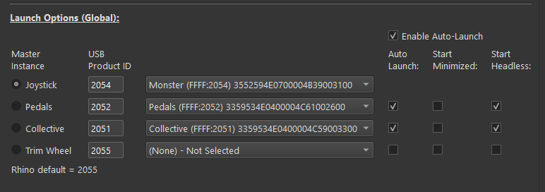

# Devices & Instances

TelemFFB runs **one instance per FFB device**. If you fly with a single VPforce joystick base, one instance is all there is and you can mostly ignore this page. If you also have VPforce-powered pedals or a collective, a separate instance drives each device — and TelemFFB manages them for you.

## Master and child instances

The instance you launch is the **master**. It owns everything global:

-   The global pages of System Settings — Launch Options, Sim Setup, theme, and the global startup behavior options are only visible in the master instance.
-   Auto-launching, monitoring, and revealing the **child** instances that drive your additional devices.

Child instances each connect to their own device and render effects for it, driven by the same simulator telemetry. They can run with a normal window, minimized, or headless (no window at all).

While DCS, MSFS and IL-2 do not natively support FFB on rudder or collective axes, TelemFFB plays its full effects suite through any VPforce device — so pedals and collectives get buffeting, ground rumble, and the rest even where the sim itself offers nothing.

## How TelemFFB finds your devices

In most cases, you do not need to configure anything: on startup, TelemFFB enumerates the connected VPforce devices and **auto-assigns** any unassigned device slot.

-   Assignment is by the device's name as configured in VPforce Configurator: a name containing *Joystick*, *Pedals*, *Collective*, or *Trimwheel* assigns the device to that role.
-   Devices whose names do not match fall back to the default Product IDs: `2055` joystick, `2054` pedals, `2053` collective, `2052` trimwheel.
-   Auto-assignment never overrides a slot you have already assigned.

To assign devices manually — or fix an auto-assignment — each device role on the **Launch Options** page has a **selector pulldown** listing the connected VPforce devices. Pick the device for each role directly; the USB Product ID field fills in automatically from your selection. If you pick a device that is already assigned to another role, TelemFFB asks whether to override the other assignment or cancel.

## Launch Options

!!! note
    The Launch Options are global and are only visible in the Master instance of TelemFFB

These settings are found in **System → System Settings → Launch Options**. They control which device each instance connects to and which instances start automatically.

{ width="650px" }

-   **Device Selector**

    -   Select the connected VPforce device for each role from the pulldown. Auto-assigned devices appear pre-selected.

-   **Enable Auto-Launch**

    -   Tick this checkbox to enable the auto-launch feature which will start additional instances of TelemFFB to communicate with your additional FFB devices.

-   **Master Instance Radio Buttons**

    -   Independently of the auto-launch feature, the selected radio button defines the device that TelemFFB will connect to when it is launched.

    -   When combined with the auto-launch feature, the selected device will act as the master instance for any additional spawned instances of TelemFFB.

-   **USB Product ID**

    -   Filled automatically from the device selector. The VID for all VPforce control boards is `FFFF`; each device's PID can be viewed (and changed) in the VPforce Configurator utility.

-   **Instance Auto Launch Options**

    -   Auto Launch

        -   Enable or disable auto-launching of an instance when the master instance loads.

    -   Start Minimized

        -   Start the selected instance with its window minimized

    -   Start Headless

        -   Start the selected instance with its window hidden

## Working with child instances

After starting TelemFFB with auto-launch enabled, all of the device icons appear in the master instance's **Active Devices** area. From there you can monitor each device's status and switch between devices to configure their settings — each device has its own settings for every aircraft, so your pedals and joystick are tuned independently. See [Active Devices Area](ui-overview.md#active-devices-area) for details.

To bring up the window of a minimized or headless child instance:

-   use the master instance's **Window** menu, or
-   right-click the system tray icon and use the **Instances** menu.
