# The DirectInput Tap

DCS, IL-2, and Falcon BMS compute their own force feedback and send it to the stick over DirectInput. TelemFFB has no involvement in the game-generated forces and effects being played on the device: the game drives the device directly, and TelemFFB adds its telemetry-driven effects on top.

The **DirectInput Tap** captures the effects the game computes and sends them to TelemFFB, which renders them on the device. The game cannot detect the difference: it continues to compute its effects, and everything it exports continues to work.

## Why use it

With the tap active, the game's own effects become visible and adjustable in TelemFFB:

- Each game effect type gets an **enable toggle and a gain slider** - controls the games themselves do not offer.
- The game's spring can be corrected per axis: swap axes, invert, and scale, with a live force readout on the sliders.
- The game's effects appear in the effects monitor by name, so you can see exactly what the game is sending at any moment.

## Supported simulators

| Simulator | Joystick | Pedals |
|---|---|---|
| DCS | Yes | - |
| IL-2 Great Battles | Yes | - |
| IL-2 Korea | Yes | Yes |
| Falcon BMS | Yes | - |

IL-2 Korea is the only simulator in this group that renders force feedback to pedals.

## How it works

TelemFFB places a small wrapper library (`dinput8.dll`) in the game's folder, and the game loads it in place of the system DirectInput library. The wrapper passes everything through unchanged, with one exception: the force-feedback effects of the devices you choose to capture. Those effects go to TelemFFB instead of the device.

!!! important "Start TelemFFB before the game"
    The wrapper decides once, when the game starts, whether to engage. It only engages if TelemFFB is already running. If you start the game first, the wrapper stays inactive for that session; restart the game with TelemFFB running.

    This check is the `RequireTelemFFB` setting in `dinput8.ini`, and it is `true` by default for a reason: it makes the wrapper fail safe. Captured devices only work while TelemFFB is running to render their forces, so a wrapper that engaged unconditionally would leave those devices with no force feedback at all in any session without TelemFFB. With the check in place, the wrapper goes inert instead, and the game's own force feedback works normally; this prevents FFB from appearing "broken" if you happen to run the simulator without TelemFFB for any reason.

    Setting it to `false` removes the start-order requirement, at exactly that risk: whenever the game runs without TelemFFB, the captured devices' forces are swallowed with nothing re-rendering them, and nothing on screen says why. Leave it `true` unless you accept that trade.

## Setting it up

1. Open **System → System Settings** and go to the simulator's page on the **Simulator Setup** tab.
2. Enable the **DirectInput Tap** toggle. A status panel appears below it. The panel locates the game install automatically (from the configured path, the registry, or a Steam library scan) and shows the wrapper state for each of the game's executable folders.

    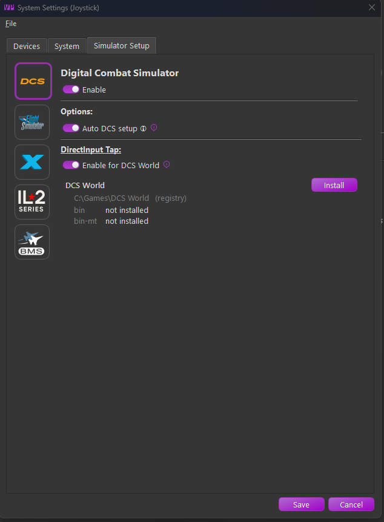{ width="650px" }

3. Click **Install**.
4. Choose which devices the tap captures in the device dialog that opens.

    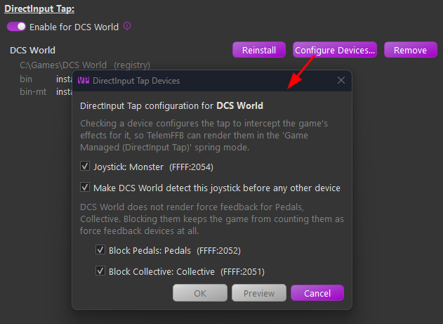{ width="550px" }

5. TelemFFB writes both files beside each of the game's executables (for DCS, both `bin` and `bin-mt`): the `dinput8.dll` wrapper, and a `dinput8.ini` configuration carrying capture rules for the devices you chose. Setup is complete; nothing further is required. The panel then shows the installed state, with each folder's wrapper version and configuration:

    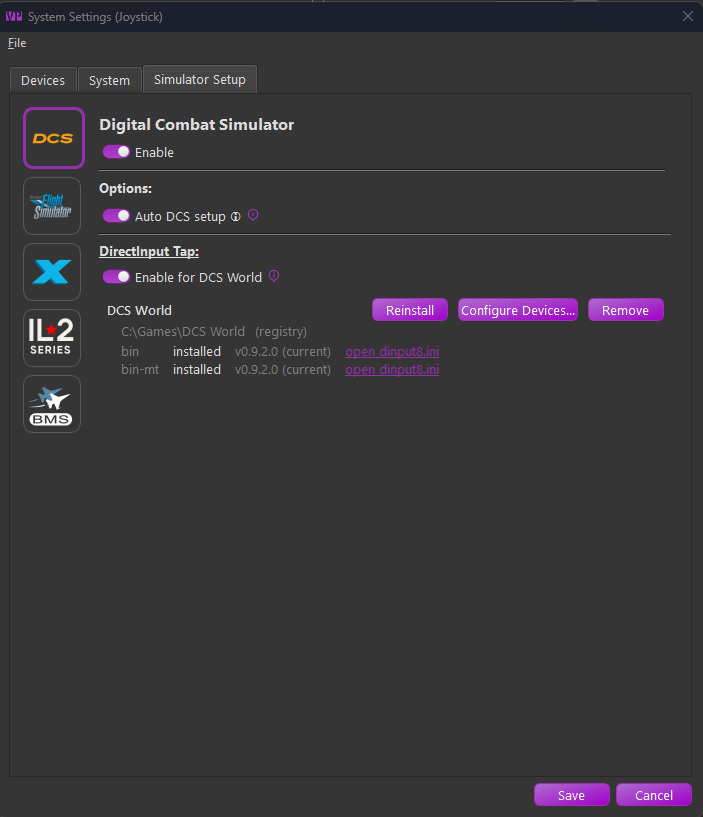{ width="650px" }

!!! note "Games installed under Program Files"
    Windows may deny writes to the game's folder for a game installed under `Program Files`. TelemFFB tells you when this is the cause. Run TelemFFB as administrator once to install, or grant the folder write access.

### If a dinput8.dll is already installed

Some game folders already carry a `dinput8.dll` wrapper. TelemFFB recognizes the common case, the community **dcs-force-feedback-fix** wrapper that the tap is built from: the panel reports it as an ffb-fix wrapper, and Install offers an upgrade.

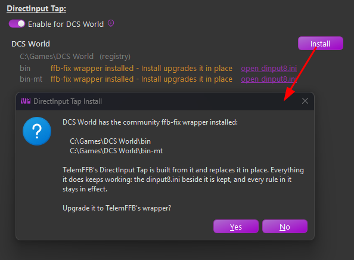{ width="620px" }

TelemFFB's wrapper is a **superset** of the original ffb-fix wrapper: every rule in the existing `dinput8.ini` (per-device `block`, `allow`, and scaling rules, `[DeviceOrder]`) keeps working exactly as before, so the upgrade is safe. The file is kept as it is, with two exceptions: TelemFFB adds a `tap` rule for the joystick device selected in TelemFFB, and offers `block` rules for any configured pedal or collective devices the file does not already cover. Rules you already wrote are recognized, not duplicated - a name rule that already blocks your pedals is left alone.

A `dinput8.dll` that TelemFFB cannot identify is reported as "another dinput8.dll installed", and Install asks the more careful question. If the DLL belongs to a different mod or utility, replacing it will stop that tool from working.

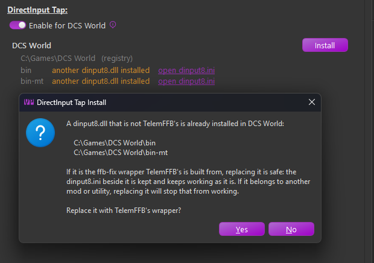{ width="620px" }

### Fresh install or existing configuration

Which path Install takes depends on whether the game's folders already hold a `dinput8.ini`:

- On a **fresh install** (no configuration anywhere), the device dialog opens automatically as part of Install, as in the steps above.
- Where a configuration **already exists** (an earlier install, or a file you wrote yourself), Install and Reinstall lay down only the wrapper and leave the file alone. To choose or change the captured devices, use **Configure Devices...** on the panel.

**Configure Devices...** opens the same device dialog over the existing configuration. **Preview** shows the proposed changes as a side-by-side diff of each folder's `dinput8.ini` before anything is written; **OK** applies them immediately. Only the lines you were asked about change; every rule and comment you wrote yourself is kept.

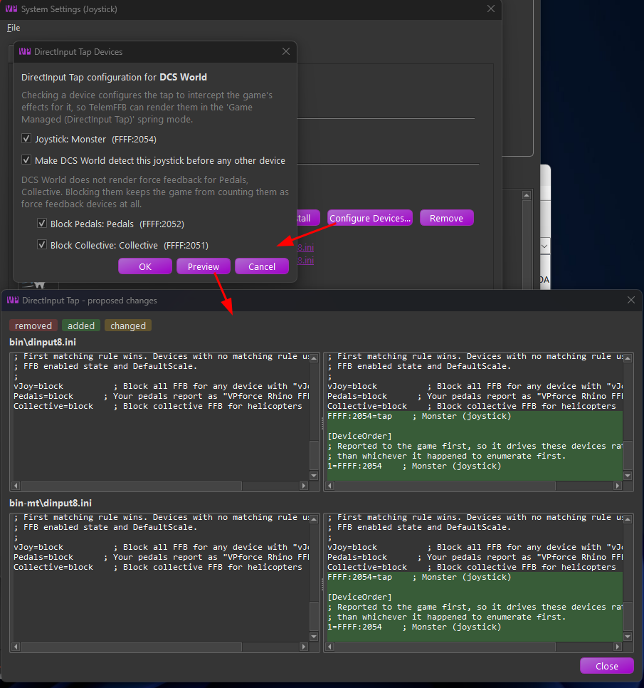{ width="650px" }

## Rendering the game's spring

The tap relays the game's spring, but rendering it is a per-aircraft choice. On the **Settings** tab, set **Joystick Spring Mode** to **Game Managed (DirectInput Tap)**.

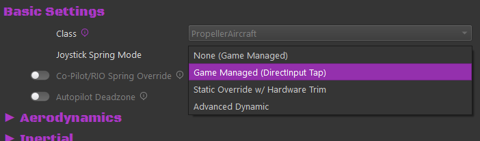{ width="450px" }

For IL-2 Korea pedals, the pedals instance offers the same mode as **Game Managed (DirectInput Tap, Korea Only)**.

You do not have to select the mode aircraft by aircraft. Set it at the **simulator or aircraft-class level** with the [offline settings editor](settings-model.md#offlineglobal-simclass-configuration), and it becomes the default spring mode for every aircraft in that simulator or class. Individual aircraft can still override it. Setting a class or sim-wide value also works from a loaded aircraft: right-click the **x** icon on the setting and promote it, as described in [How Settings Work](settings-model.md#reading-the-settings-tab).

Selecting the mode reveals the **Tap: Axis Corrections and Gain** group:

- **Tap: Swap X/Y FFB Axes** - swap which game axis lands on which device axis.
- **Tap: Invert X Axis FFB** / **Tap: Invert Y Axis FFB** - reverse an axis whose forces push the wrong way.
- **Tap: X Axis Spring Gain** / **Tap: Y Axis Spring Gain** - scale the game's spring force. 100% renders it exactly as the game commanded. The percentage on the slider handle is the current rendered force; pinned at 100% means the gain is clipping at the device's maximum.

## The game's other effects

The **Tap: Additional Game Effects** group controls everything else the game sends, each type with its own enable toggle and gain:

- **Tap: Constant Forces** - stick kicks, recoil, and similar pushes.
- **Tap: Periodic Vibrations** - rumble, buffet, and other oscillations.
- **Tap: Damper Effects**, **Tap: Inertia Effects**, **Tap: Friction Effects** - the game's condition effects.

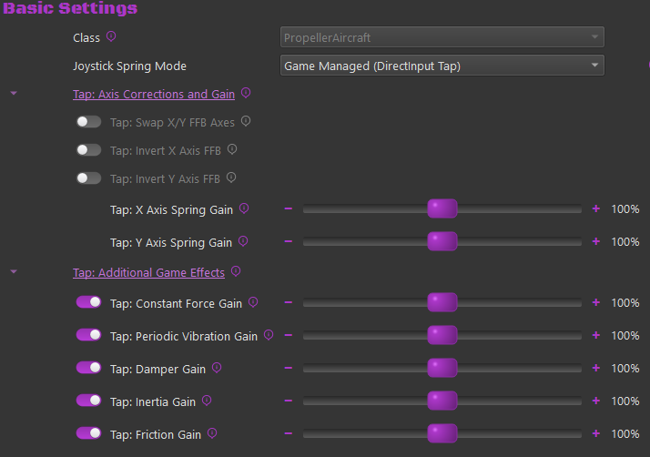{ width="650px" }

Captured effects appear in the effects monitor as **Game Spring (DirectInput Tap)**, **Game Periodic (DirectInput Tap)**, and so on, alongside TelemFFB's own effects.

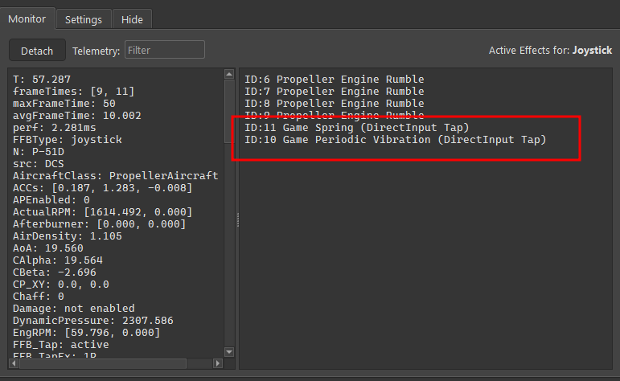{ width="650px" }

!!! warning "Doubled effects"
    A game effect and the equivalent TelemFFB telemetry effect can both be enabled at once (the game's gunfire rumble plus TelemFFB's gunfire effect, for example). If an effect feels doubled, disable one of the pair.

## When something is misconfigured

TelemFFB reports tap misconfigurations on the error line of the effects area while you fly, with the cause and the fix:

- Spring mode is **None (Game Managed)** while the tap is capturing the device. The tap prevents the game's spring from reaching the device, so this combination leaves no spring at all. Select the tap spring mode, or remove the device from the capture list.
- The tap spring mode is selected but the tap is not capturing, usually because you started the game before TelemFFB.

The System Settings dialog also warns at configuration time when a selected device needs a tap rule that no enabled simulator provides.

## The configuration file

TelemFFB writes a `dinput8.ini` configuration beside the wrapper in each game folder. It generates the file once, in the wrapper's own documented format, and afterwards only **adds** to it (when your device selection changes, for example). It never rewrites existing content, so you can edit the file freely.

- Device rules are keyed by USB ids (`FFFF:2054=tap`), so they survive device renames.
- The wrapper writes a log for each game to `%LOCALAPPDATA%\VPForce-TelemFFB\log\tap`, one file per game executable.

## Updates and removal

TelemFFB ships the wrapper and knows which version each game folder holds:

- The status panel marks an outdated copy with "→ v*X* available"; **Reinstall** updates it in place, keeping the configuration.
- At startup, TelemFFB offers to update every outdated wrapper across your simulators in a single prompt, each simulator deselectable.

    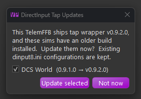{ width="500px" }

- The same update is available any time from the simulator's tap status panel, which flags the out-of-date copy:

    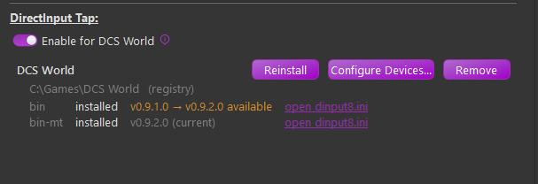{ width="650px" }

**Remove** deletes only TelemFFB's own wrapper. TelemFFB never removes a `dinput8.dll` that another program installed, and never removes your configuration file. When you disable the tap or the simulator, TelemFFB offers the same cleanup.
