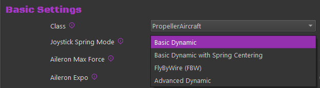
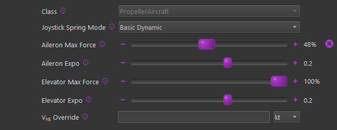
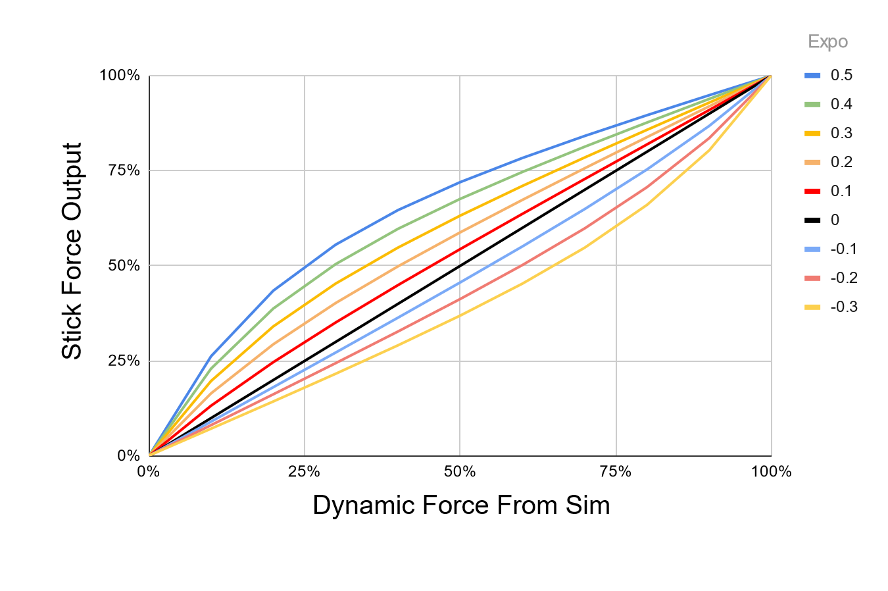
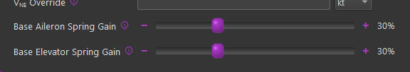
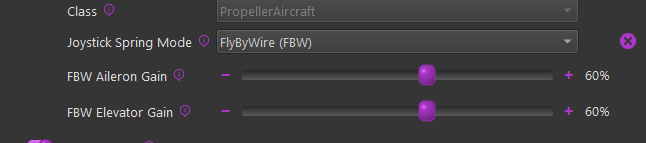

# Axis Control & Spring Modes

With MSFS and X-Plane, TelemFFB is the source of the axis positions the simulator receives. The **Axis Control** setting (`telemffb_controls_axes`) enables this: TelemFFB reads your physical stick, applies the spring model and any trim or autopilot offsets, and sends the resulting axis values to the simulator.

!!! important "MSFS: unbind your axes"
    MSFS has no toggle to override external axis control. When Axis Control is enabled, ***you must unbind your joystick and/or pedal axes inside MSFS*** (or SPAD.neXt). Otherwise MSFS's own reading of your physical axis will conflict with the position TelemFFB is sending.

!!! note "X-Plane"
    You do **not** need to unbind your axes in X-Plane. The TelemFFB X-Plane plugin uses the simulator's built-in override datarefs, so the axis is overridden automatically when the feature is enabled.

## Axis Settings

**Axis Scale**

These sliders scale the axis value sent to the sim. A value of 50% produces 50% control-surface deflection in the sim at 100% physical deflection.

**Custom Axis Variables**

Some aircraft do not use the standard SimConnect axis events, or use custom `L:` variables. Use these checkboxes to override the default variable sent, or to enter a custom one. Enter `VARNAME` for a SimVar or `L:VARNAME` for an `L:Var`.

## How the Axis Positions Reach the Sim

### MSFS

TelemFFB sends each axis over SimConnect using the sim's standard axis events. Which events are used depends on the aircraft class:

| Axis | Fixed wing | Helicopter |
|---|---|---|
| X (roll) | `AXIS_AILERONS_SET` | `AXIS_CYCLIC_LATERAL_SET` |
| Y (pitch) | `AXIS_ELEVATOR_SET` | `AXIS_CYCLIC_LONGITUDINAL_SET` |
| Rudder / pedals | `AXIS_RUDDER_SET` | `ROTOR_AXIS_TAIL_ROTOR_SET` |
| Collective | — | `AXIS_COLLECTIVE_SET` |

The physical axis position is mapped onto the event's full input range (±16384). Axis curves are not supported in this implementation, but the **Axis Scale** sliders above can reduce sensitivity — a scale of 50% sends only half the input range across the full physical travel, giving less sensitive control at the expense of range of movement.

The **Custom Axis Variables** option replaces the standard event for an axis: TelemFFB writes the position to the SimVar or `L:Var` you specify instead.

### X-Plane

TelemFFB streams the axis values to its X-Plane plugin, which engages the simulator's native control overrides and then writes the positions into the sim's own control datarefs on every flight loop:

| Device | Override dataref | Position dataref |
|---|---|---|
| Joystick | `sim/operation/override/override_joystick_roll` `sim/operation/override/override_joystick_pitch` | `sim/joystick/yoke_roll_ratio` `sim/joystick/yoke_pitch_ratio` |
| Pedals | `sim/operation/override/override_joystick_heading` | `sim/joystick/yoke_heading_ratio` |
| Collective | `sim/operation/override/override_prop_pitch` | `sim/cockpit2/engine/actuators/prop_ratio_all` |

The collective mapping is not a workaround: X-Plane has no dedicated collective dataref, and Laminar's dataref documentation designates the prop handle ratio as the helicopter collective.

Because these overrides are part of the X-Plane SDK, no unbinding is required — while an override is active the sim ignores its own joystick input for that axis. Unlike MSFS, the targets are fixed: there is no Custom Axis Variables option for X-Plane. If an override is ever left stuck (after a TelemFFB crash, for example), the plugin's menu in X-Plane (**Plugins → TelemFFB → Clear All Overrides**) resets them.

## Spring Modes

There are multiple ways the axis spring gains can be configured for
aircraft in MSFS/X-Plane.

**Basic Dynamic** - Spring gain changes based on increasing/decreasing dynamic pressure as airspeed changes, includes additional dynamic forces related to slip, AoA and g-forces.

**Basic Dynamic with Spring Centering** - Adds a fixed gain centering force to the Dynamic spring effects. Where the standard Dynamic effect can reach 0 spring and 0 airspeed, the addition of the base centering force will set the lower boundary of the spring effect to the configured value

**FlyByWire (FBW)** - Static spring force is configured per axis based on the settings.

**Advanced Dynamic** - Define the spring gain mapping as a visual curve over the aircraft's speed envelope. See [Advanced Spring & G-Force Curves](spring-curves.md)

{ width="520px" height="144px" }

### Dynamic

There are settings which directly affect the max force per axis as well as an "exponent" setting which affects the curve at which the gain will be applied over the speed envelope of the aircraft.

{ width="482px" height="186px" }

**Max Force Settings**

The "Max Force" settings will effectively set the spring gain that will be achieved at the V~NE~ (never exceed) speed of the aircraft, although the calculation is more sophisticated than a basic linear gain-to-speed mapping. It uses the known aircraft info to determine the dynamic pressure (Q) that should be achieved at V~NE~ for the aircraft and then feeds that information into the dynamic forces calculation to determine the final spring gain at any given point in time.

100% of the configured **Max Force** is achieved at the aircraft's V~NE~ speed as read from telemetry. In the event that the V speeds defined in the aircraft's configuration files are incorrect, or if you want to override the value, it can be changed with the **V**~**NE**~** Override **setting.

The Max Force adjustment slider handle will fade from gray to green as Max Force is reached, and the handle will show a percentage of dynamic force applied.

**Expo Settings**

Since Rhino cannot produce the actual real-life forces that could be reached, Expo amplifies those forces at lower speeds, where the feeling of control authority is quickly lost at stall speeds for example. An Expo value of 0.5 doubles stick forces at 25% of V~NE~. For some jets, you might want diminished forces until closer to V~NE~, so you can set a negative Expo value.

{ width="513px" height="320px" }

### Dynamic + Spring Centered

The "Spring Centered" option will still leverage the Dynamic
adjustments mentioned above, however there will be a minimum spring
gain set on a given axis based on the sliders.

With this configured, the dynamic spring gain will range from a
low-point of the "Spring Centered" gain value to a high-point of the
Max Force setting in the dynamic adjustment settings.

{ width="576px" height="102px" }

### Fly By Wire (FBW)

Enabling the FBW option will override any configurations in the
Dynamic and/or Spring Centered settings and apply a fixed gain value
on a given axis. When this mode is active, the spring gain is static
and will not vary based on airspeed or any other aerodynamic
conditions.

{ width="573px" height="127px" }
