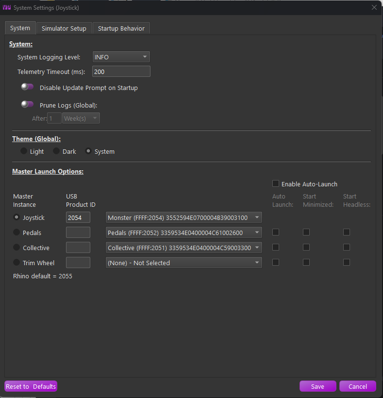

# Quick Start

This walkthrough takes you from download to feeling your first effects. Each step links to the page with full detail.

## 1. Install TelemFFB

Download the latest release zip from the [GitHub Releases](https://github.com/walmis/VPforce-TelemFFB/releases) page and extract it where you want the application to live. There is no installer — run `TelemFFB.exe` from the extracted folder.

!!! note
    If your antivirus flags the executable, see [TelemFFB and Antivirus Software](installation.md#telemffb-and-antivirus-software). This is a known false-positive pattern with PyInstaller-packaged applications.

## 2. First launch: System Settings

The first time you start TelemFFB, the System Settings window opens automatically.

{ width="600px" }

-   On the **Launch Options** page, verify your devices. TelemFFB auto-assigns connected VPforce devices by their names (Joystick, Pedals, Collective) — the selector pulldowns should already show each device in its role. If you have more than one device, enable auto-launch so the additional instances start automatically — see [Devices & Instances](devices-instances.md).
-   On the **Sim Setup** page, enable each simulator you fly and let the auto-setup features install the required export scripts or plugins — see [Connecting Your Simulator](sim-setup.md).

Save the settings. TelemFFB connects to your device and sits ready for telemetry.

## 3. Fly

Start your simulator and load a flight. TelemFFB detects the aircraft from the telemetry, matches it to a profile, and applies the settings automatically. Many aircraft ship with tuned default profiles; anything unmatched gets sensible defaults for its aircraft class.

**Verify it is working:**

-   The status icon shows **Running** when telemetry is flowing (the system tray icon turns green too).
-   The **Current Aircraft** and **Matched Model** fields show what TelemFFB detected.
-   The **Monitor tab** shows live telemetry values and the effects currently playing.

See the [UI Overview](ui-overview.md) for what everything on the main window means.

## 4. Tune

Open the **Settings tab** while flying. Every change applies immediately — no restart, no save-and-reload:

-   Slider handles turn **green** while their effect is actively playing, so you can see what you are feeling.
-   Toggle an effect off and on to isolate it.
-   Made a mess? Click the **x** icon next to any modified setting to return it to the default. See [How Settings Work](settings-model.md).

## 5. Go deeper

-   **MSFS or X-Plane**: TelemFFB provides your entire force feedback implementation — spring forces, trim, autopilot. Read the [MSFS & X-Plane guide](sim-msfs-xplane.md) next; it is the most important page for these sims.
-   **DCS**: the sim provides native FFB; TelemFFB layers additional effects on top. The [DCS guide](sim-dcs.md) explains how the two interact.
-   **IL-2**: enable the shake-master settings to replace IL-2's basic shakes with configurable ones — see the [IL-2 guide](sim-il2.md).
-   Browse the [Effects Reference](effects-overview.md) to see everything you can enable.
