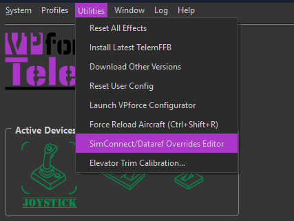
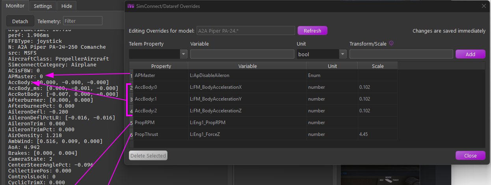

# Telemetry Overrides

An advanced MSFS/X-Plane feature: change **where a telemetry item's data comes from**, or subscribe to **additional** telemetry items, per aircraft. Open the editor from **Utilities → SimConnect/Dataref Overrides Editor**, with an aircraft loaded (or selected in the offline editor). Overrides are stored against the aircraft's match pattern, and changes are saved — and applied — immediately.

{ width="427px" }

{ width="760px" }

## Why it exists

TelemFFB's effects consume a fixed set of telemetry items (the names you see in the Monitor tab). Normally each item is wired to a standard SimConnect variable or X-Plane dataref — but not every aircraft populates the standard sources:

-   **Source overrides.** Sophisticated addon aircraft often implement their own systems in custom variables and leave the standard ones stale. The classic case is the **autopilot indication**: an addon whose AP never drives the standard `AUTOPILOT MASTER` simvar breaks every AP-aware TelemFFB feature — until you override `APMaster` to read the addon's own variable. The same applies to custom engine and flight models (RPM, thrust, accelerations).
-   **Additional subscriptions.** An override whose Telem Property is a *new* name creates a brand-new telemetry item. This is how the special aircraft implementations (the HPG helicopters, for example) receive their custom `L:Var`s — their shipped default profiles include the required overrides out of the box.

## How it works

-   **MSFS** — the override replaces (or adds) the variable in TelemFFB's SimConnect subscription set. The Variable field takes a SimVar name (`VARNAME`) or an LVar (`L:VARNAME`); the Unit is the SimConnect unit to request (`bool`, `enum`, `number`, `Percent Over 100`, `degrees`, `meters/second`).
-   **X-Plane** — TelemFFB instructs its X-Plane plugin to subscribe to the given dataref (Unit: `int` or `float`) and export it under the telemetry item's name.

Either way, the result flows into the same telemetry item the effects already consume — verify it live in the **Monitor tab**. When an aircraft with active overrides loads, the status area shows a **Telem Ovd** pill with counts by tier (shipped default vs your own); hovering it lists every active override.

!!! important "Additional profiles: clone, don't create from scratch"
    Overrides belong to the matched model profile. If you need an additional profile — a livery whose name does not match the shipped pattern, for example — you must **clone it from the default profile** so the overrides carry over. An entry created from scratch will *not* pick them up, and every effect that depends on the overridden telemetry silently loses its data. (This is the general form of the rule the [HPG helicopters](msfs-xp-helicopters.md#hpg-airbus-helicopters-msfs-only) document for their `L:Var` subscriptions.) See [Aircraft Profiles](aircraft-profiles.md) for cloning.

## The editor fields

-   **Telem Property** — the telemetry item to feed. The dropdown lists the standard overridable items, but the field is editable, which enables two more forms:
    -   `Name:index` targets one element of a *list* telemetry item — the screenshot overrides `AccBody:0/1/2` (the X/Y/Z body accelerations) individually.
    -   A name not in the list creates a **new** telemetry item under that name.
-   **Variable** — the SimVar/LVar (MSFS) or dataref path (X-Plane) to read.
-   **Unit** — the unit/type to request, per sim as above.
-   **Transform/Scale** — converts the raw value into the range the telemetry item expects. Leave blank for the raw value, enter a **number** for a simple multiplier, or (MSFS) a **math expression** using `x` as the input — e.g. `(x - 50) * 0.02` maps 0–100 onto −1–1. Standard operators and parentheses only; for X-Plane the conversion is a numeric multiplier applied by the plugin.

!!! important "The transform must make the value equivalent to the original"
    TelemFFB's effects expect each telemetry item in the **units, range, and sign of its original standard source** — an override changes where the data comes from, not what the consumers expect. Whatever format the replacement variable uses natively, it is your job (via the Transform/Scale) to deliver an equivalent value. In the example below, the addon's body accelerations arrive in m/s² where the standard item is in g — hence the 0.102 (≈1/9.81) scale. An override that "works" but skips this conversion feeds every dependent effect distorted data.

Rows shown **greyed out** come from the aircraft's shipped default profile — they document what the curated profile already subscribes and cannot be deleted here. Your own rows (source "user") can be selected and deleted.

## Reading the example

The screenshot shows a curated set for the A2A Comanche — an addon with its own physics and systems model:

| Override | Why |
|---|---|
| `APMaster` ← `L:ApDisableAileron` | The addon's AP state lives in its own LVar; the standard AP simvar would read stale. Restores AP-aware behavior. |
| `AccBody:0/1/2` ← `L:FM_BodyAcceleration X/Y/Z`, scale `0.102` | The addon computes its own body accelerations; 0.102 ≈ 1/9.81 converts m/s² to g, the range the effects expect. |
| `PropRPM` ← `L:Eng1_PropRPM` | The custom engine model's RPM, not the standard prop simvar. |
| `PropThrust` ← `L:Eng1_ForceZ`, scale `4.45` | Thrust from the custom model, scaled into the expected units. |

## Cautions

-   An override changes the input for **every effect** that consumes that telemetry item — a wrong variable or scale can quietly distort several effects at once. Sanity-check the value in the Monitor tab against what you expect (units and sign included).
-   Core flight-dynamics items (attitude, airspeed, AoA and similar) are deliberately absent from the dropdown — overriding the fundamentals is rarely the right fix.
